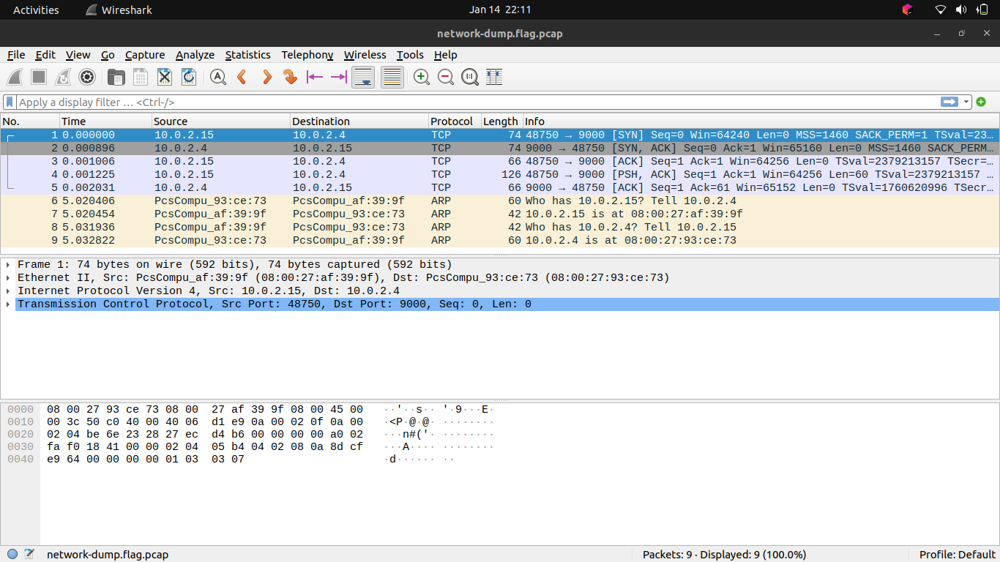
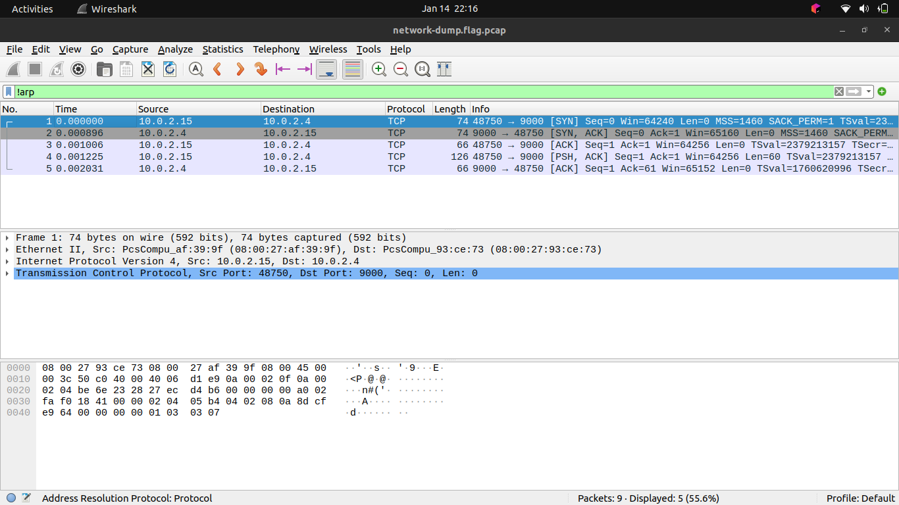
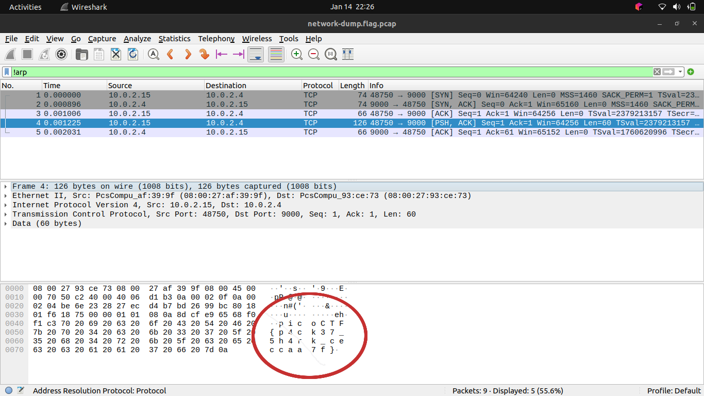

# Packets Primer

[Link to the challenge](https://play.picoctf.org/practice/challenge/286)

## Description

Download the packet capture file and use packet analysis software to find the flag.

- [Download packet capture](https://artifacts.picoctf.net/c/194/network-dump.flag.pcap)

## Hints

- Hint 1: Wireshark, if you can install and use it, is probably the most beginner friendly packet analysis software product.

## Solution

Firstly, I downloaded the `.pcap` file.

```bash
$ wget https://artifacts.picoctf.net/c/194/network-dump.flag.pcap
```

Then I use [Wireshark](https://www.wireshark.org/) to open the downloaded file.

```bash
$ wireshark network-dump.flag.pcap
```



There's only 9 packets here and 4 of them are **ARP**. The flag is unlikely to be in these packets as these are just messages relating IP addresses and hardware addresses. I filtered out the **ARP**s using `!arp` filter.

> `ARP` stands for **Address Resolution Protocol** and these messages are common in every network capture as it is needed to connect a **hardware address** to an **IP address**.



Of the remaining 5 packets, the first 3 are the TCP handshake and so they can be ignored. Of the remaining 2 packets, I look at the one that has the `PSH` flag set, which means there is data for the application in the packet:

> The **TCP handshake**, also known as the **three-way handshake** can be identified by the flags in the packets. First `SYN` from host A, the `SYN, ACK` from host B, then finally, `ACK` from host A. `SYN` stands for **synchronization**, and `ACK` stands for **acknowledgement**. Both parties synchronize and acknowledge.



## Flag

picoCTF{p4ck37_5h4rk_ceccaa7f}
