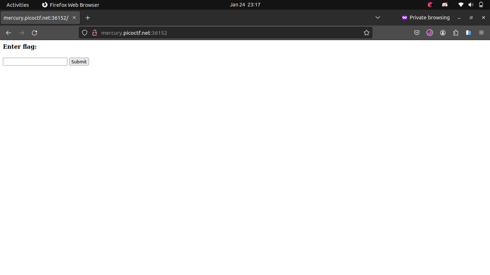
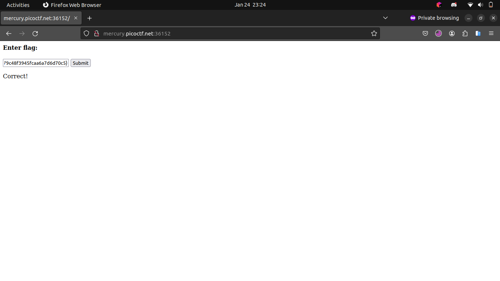

# Some Assembly Required 1

## Description

[http://mercury.picoctf.net:36152/index.html](http://mercury.picoctf.net:36152/index.html)

## Hints

(None)

## Solution

The page contains an input text field and a button.



The button calls a function `onButtonPress()` from a javascript file `G82XCw5CX3.js`.

```javascript
const _0x402c=['value','2wfTpTR','instantiate','275341bEPcme','innerHTML','1195047NznhZg','1qfevql','input','1699808QuoWhA','Correct!','check_flag','Incorrect!','./JIFxzHyW8W','23SMpAuA','802698XOMSrr','charCodeAt','474547vVoGDO','getElementById','instance','copy_char','43591XxcWUl','504454llVtzW','arrayBuffer','2NIQmVj','result'];const _0x4e0e=function(_0x553839,_0x53c021){_0x553839=_0x553839-0x1d6;let _0x402c6f=_0x402c[_0x553839];return _0x402c6f;};(function(_0x76dd13,_0x3dfcae){const _0x371ac6=_0x4e0e;while(!![]){try{const _0x478583=-parseInt(_0x371ac6(0x1eb))+parseInt(_0x371ac6(0x1ed))+-parseInt(_0x371ac6(0x1db))*-parseInt(_0x371ac6(0x1d9))+-parseInt(_0x371ac6(0x1e2))*-parseInt(_0x371ac6(0x1e3))+-parseInt(_0x371ac6(0x1de))*parseInt(_0x371ac6(0x1e0))+parseInt(_0x371ac6(0x1d8))*parseInt(_0x371ac6(0x1ea))+-parseInt(_0x371ac6(0x1e5));if(_0x478583===_0x3dfcae)break;else _0x76dd13['push'](_0x76dd13['shift']());}catch(_0x41d31a){_0x76dd13['push'](_0x76dd13['shift']());}}}(_0x402c,0x994c3));let exports;(async()=>{const _0x48c3be=_0x4e0e;let _0x5f0229=await fetch(_0x48c3be(0x1e9)),_0x1d99e9=await WebAssembly[_0x48c3be(0x1df)](await _0x5f0229[_0x48c3be(0x1da)]()),_0x1f8628=_0x1d99e9[_0x48c3be(0x1d6)];exports=_0x1f8628['exports'];})();function onButtonPress(){const _0xa80748=_0x4e0e;let _0x3761f8=document['getElementById'](_0xa80748(0x1e4))[_0xa80748(0x1dd)];for(let _0x16c626=0x0;_0x16c626<_0x3761f8['length'];_0x16c626++){exports[_0xa80748(0x1d7)](_0x3761f8[_0xa80748(0x1ec)](_0x16c626),_0x16c626);}exports['copy_char'](0x0,_0x3761f8['length']),exports[_0xa80748(0x1e7)]()==0x1?document[_0xa80748(0x1ee)](_0xa80748(0x1dc))[_0xa80748(0x1e1)]=_0xa80748(0x1e6):document[_0xa80748(0x1ee)](_0xa80748(0x1dc))[_0xa80748(0x1e1)]=_0xa80748(0x1e8);}
```

The code is obfuscated, but we can see that it calls a function `onButtonPress()` when the button is pressed. The function gets the value of the input text field, and calls the function `check_flag()` from the WebAssembly module `./JIFxzHyW8W`.\
I downloaded the `./JIFxzHyW8W` file and use `file` to check its type.

```bash
$ file ./JIFxzHyW8W
JIFxzHyW8W: WebAssembly (wasm) binary module version 0x1 (MVP)
```

I simply use `strings` to see if there is anything interesting in the file.

```bash
$ strings ./JIFxzHyW8W
memory
__wasm_call_ctors
strcmp
check_flag
input
	copy_char
__dso_handle
__data_end
__global_base
__heap_base
__memory_base
__table_base
j!	 
  F!!A
!" ! "q!# #
!% $ %q!& 
!( ' (q!) & )k!* 
!+ +
 	q!
+picoCTF{d88090e679c48f3945fcaa6a7d6d70c5}
```

The flag is `picoCTF{d88090e679c48f3945fcaa6a7d6d70c5}`. I try to submit it and it is correct.




## Flag

picoCTF{d88090e679c48f3945fcaa6a7d6d70c5}
